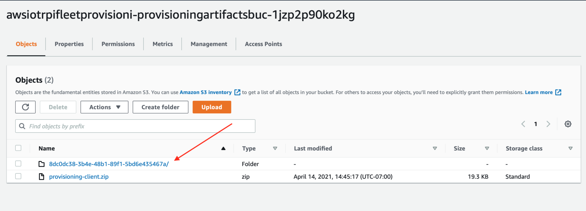
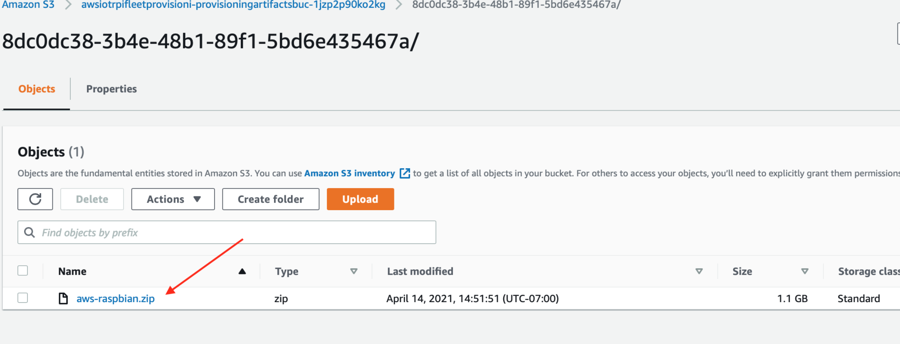

# aws-iot-rpi-fleet-provisioning

This CDK stack generates a custom raspbian image which automates onboarding of [Raspberry Pi](https://www.raspberrypi.org/) devices to [AWS IoT Core](https://aws.amazon.com/iot-core/).

## 📋 Table of content

- [Features](#-features)
- [Pre-requisites](#-pre-requisites)
- [Installation](#-install)
- [Usage](#-usage)
- [See also](#-see-also)

## 🔖 Features

- Create a custom raspbian based image which:
    - Enables connection to a WiFi network.
    - Sets a unique hostname for the device based on its Ethernet MAC address. As an example a Ethernet MAC address of **dc:a6:32:01:23:45** will result in a hostname of **dca632012345**.
    - Requests a fully functional identity on first boot with the necessary IoT permissions that the device can use for subsequent communication with AWS IoT Core.

## 🎒 Pre-requisites

- The [aws-cli](https://docs.aws.amazon.com/cli/latest/userguide/cli-chap-install.html) must be installed *and* configured with an AWS account on the deployment machine (see https://docs.aws.amazon.com/cli/latest/userguide/cli-chap-install.html for instructions on how to do this on your preferred development platform).
- This project requires [Node.js](http://nodejs.org/) and [yarn](https://yarnpkg.com/). To make sure you have them available on your machine, try running the following command.
```sh
yarn -v && node -v
```

- This cloudformation stack requires special dedicated AWS CDK resources to be provisioned. Run the following command to deploy those resources:
```sh
yarn cdk bootstrap --profile YOUR_AWS_PROFILE
```

## 🚀 Install

### 1/ Create a secret to store the password for the Wifi network used by your devices

You can do it from the AWS console or from the command line:

```sh
aws secretsmanager create-secret --name RPI_WIFI_PASSWORD \
    --description "RaspberryPi Wifi Password" \
    --secret-string 'redacted'
```

### 2/ Update the stack configuration

Update the Wifi network SSID/country, timezone and public SSH key used to connect to your devices in [lib/utils/constants.ts](lib/utils/constants.ts) file.

### 3/ Deploy the stack

Deploy this stack to your AWS account/region:

```sh
yarn && yarn build
yarn cdk deploy '*'
```

## 🛠 Usage

The CDK stack creates a [Codebuild](https://aws.amazon.com/codebuild/) project which builds the custom raspbian image and stores it in [S3](https://aws.amazon.com/s3/).

Once the stack is deployed, you can check the progress of the Codebuild project in the AWS console. Once the build is completed, download the custom raspbian image from S3 (Check the "Artifacts upload location" in the Codebuild project to find the S3 bucket).


Here is how to locate the image in the artifact upload bucket :

1. 

2. 

Burn the disk image onto the SD Card of your RaspberryPi. You can use ["Rasbperry Pi Imager"](https://www.raspberrypi.org/software/) to accomplish this.

A Raspberry Pi booting using this image will automatically request a fully functional identity on first boot with the necessary IoT permissions that the device can use for subsequent communication with AWS IoT Core (see [provisioning-client/firstboot.sh](provisioning-client/firstboot.sh)).


Assuming you're on the same Wifi network as a device using this image, you can ssh into a device using its unique hostname and the SSH key you specified in the config:

```sh
# Replace dca632012345 with your device name
ssh pi@dca632012345.local
```
## 👀 See also

- [Provisioning by Claim workflow](https://aws.amazon.com/blogs/iot/how-to-automate-onboarding-of-iot-devices-to-aws-iot-core-at-scale-with-fleet-provisioning/) blog post.
- [Safely enabling ssh in the default Raspberry Pi OS Image](https://github.com/kenfallon/fix-ssh-on-pi)
- [Edge Reference Client to demonstrate fleet provisioning for AWS IoT Core](https://github.com/aws-samples/aws-iot-fleet-provisioning)